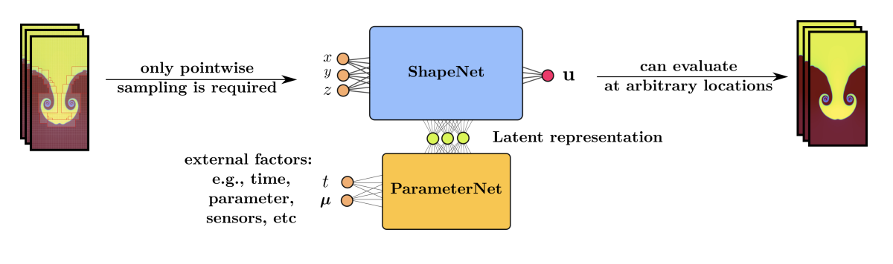
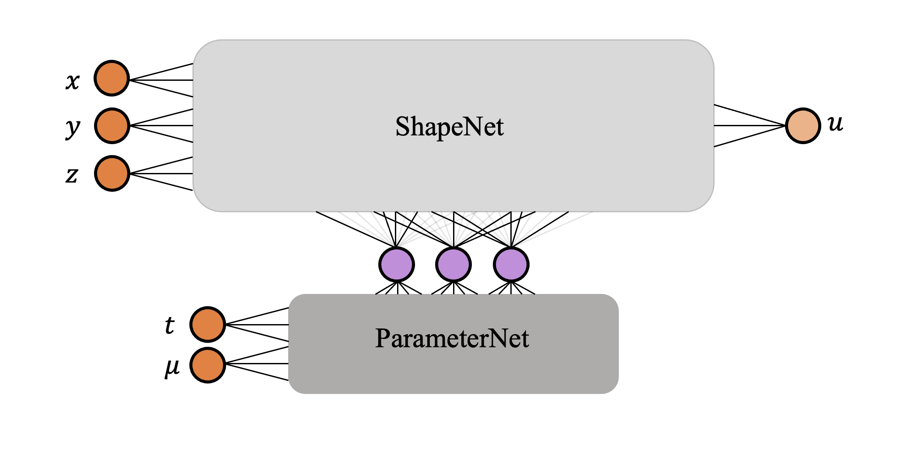

This project is forked from [Neural Implicit Flow (NIF)](https://github.com/pswpswpsw/nif#neural-implicit-flow-nif-mesh-agnostic-dimensionality-reduction) by [Shaowu Pan](http://www.shaowupan.com/). NIF is a mesh-agnostic, dimensionality reduction paradigm for modeling complex spatio-temporal fields. NIF has a hypernet structure that isolates the spatial complexity from the parameter (time, Reynold's number, etc.) complexity. For more details on NIF, please see this [paper](https://arxiv.org/pdf/2204.03216.pdf).

Here, we use the method of neural network pruning to further reduce the computational complexity of NIF. 

# Pruned Neural Implicit Flow (pNIF)

## NIF Background

NIF has a hypernetwork structure made up of two multi-layer perceptron (MLP) networks called ShapeNet and ParameterNet. The weights and biases of ShapeNet are determined entirely by the output of ParameterNet. In other words, ParameterNet learns the parameters needed for spatial reconstruction of the flow field from point-wise spatial inputs. 

|  | 
|:--:| 
| *Hypernetwork structure of NIF [[1]](#1)* |

In [[1]](#1), the authors demonstrate that NIF is capable of scalable, 3D nonlinear dimensionality reduction on spatio-temporal datasets. NIF outperforms both linear and non-linear dimensionality techniques. In terms of CPU time and memory, it outperforms a generic feed-forward network. 

NIF is built using **Keras** subclassing methods and **TensorFlow 2.x**. This allows the user to use built-in Keras compiling, training, and evaluation functions on a NIF model. A NIF model with pruning functionality, called pNIF, is also compatible with the above Keras functions. 

## Pruning NIF 

Model compression is important for modeling high-dimensional flow fields. For example, the authors use NIF to reconstruct the forced isotropic turbulence dataset from JHU Turbulence dataset [[2]](#2) with Taylor-scale Reynolds number around 433. The authors highlight that the total number of parameters required by NIF are just 3% the total original dataset array size. This can be further reduced by neural network pruning. Neural network pruning reduces model size by systematically removing parameters from a network.

Here, we use the method of neural network pruning to reduce the size of NIF and further increase its compressibility. Since ShapeNet is typically much larger than ParameterNet, removing parameters from ShapeNet, and therefore reducing its memory footprint, will be particularly advantageous. We first train a fully-connected NIF model to a minimum error. Next, we use the neural network nodal pruning to promote sparsity between the layers of ShapeNet. A target sparsity (percentage of pruned ShapeNet nodes) is specified and the nodes with the smallest L2 norms are forced to zero. The network is then retrained until a minimum error is reached. This process is repeated until most of the nodes have been pruned from the network.

TensorFlow's toolkit called the [Model Optimization Toolkit](https://www.tensorflow.org/model_optimization/guide/pruning/comprehensive_guide.md) contains functions for pruning deep neural networks. In the Model Optimization Toolkit, pruning is achieved through the use of binary masking layers that are multiplied element-wise to each weight matrix in the network. Pruning with masking layers forces parameters to zero and does not allow them to regain magnitude upon retraining. However, due to NIF's hypernetwork structure, we are implementing pruning from scratch via a single masking layer over the output of ParameterNet. To effectively reduce the size of ShapeNet, we are using nodal pruning (as opposed to weight pruning), such that entire nodes of ShapeNet are removed. 

|  | 
|:--:| 
| *Pruning output of ParameterNet in order to reduce the size of ShapeNet.* |

## References
<a id="1">[1]</a> 
Pan, Shaowu, Steven L Brunton, and J. Nathan Kutz. “Neural Implicit Flow: a mesh-agnostic dimensionality reduction paradigm of spatio-temporal data.” arXiv preprint arXiv:2204.03216 (2022). https://arxiv.org/pdf/2204.03216.pdf

<a id="2">[2]</a>
Li, Yi, Eric Perlman, Minping Wan, Yunke Yang, Charles Meneveau, Randal Burns, Shiyi
Chen, Alexander Szalay, and Gregory Eyink. "A public turbulence database cluster and
applications to study lagrangian evolution of velocity increments in turbulence." Journal
of Turbulence, 9:N31, 2008. doi: 10.1080/14685240802376389. URL https://doi.org/
10.1080/14685240802376389.
